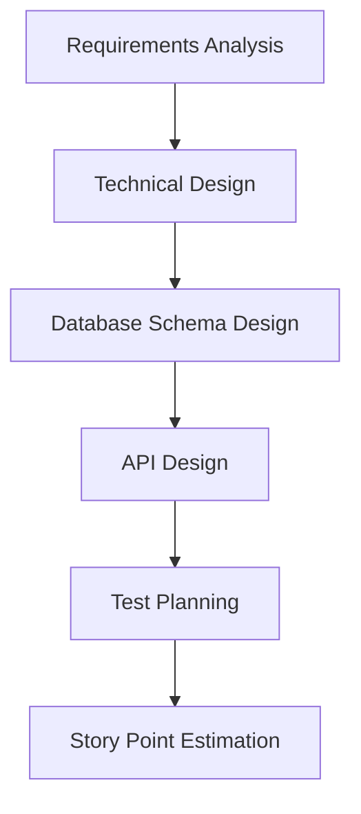
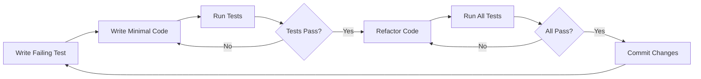
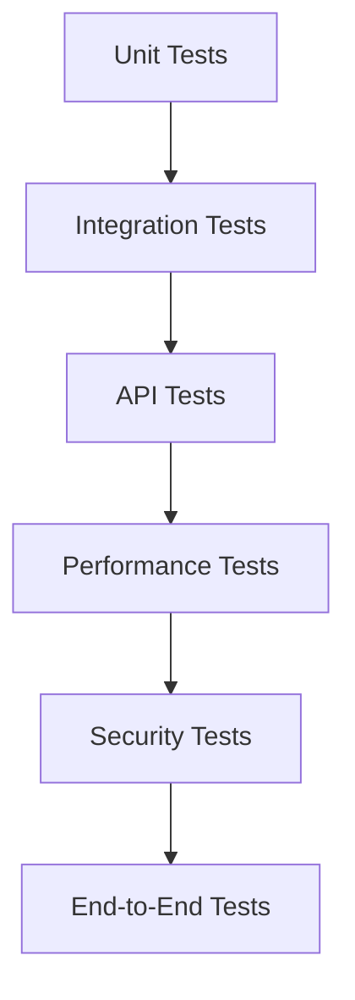
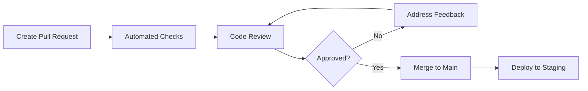
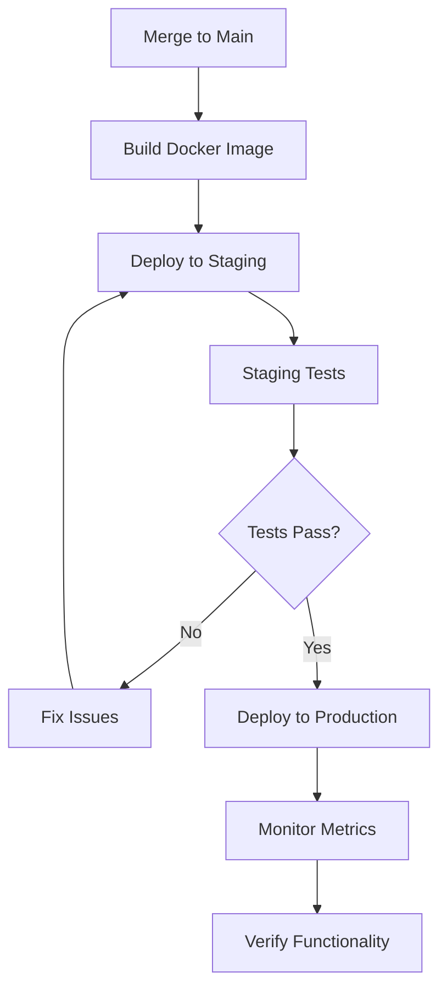

# Development Workflow

## Workflow Overview
**Name:** Takharrujy Development Workflow  
**Type:** Feature Development with TDD  
**Duration:** 2-3 weeks per sprint  
**Team Size:** 2 developers  

## Workflow Stages

### 1. Planning and Analysis


**Duration:** 2-3 days  
**Deliverables:**
- Technical specification document
- Database migration scripts
- API endpoint specifications
- Test scenarios and acceptance criteria
- Story point estimates

**Commands:**
```bash
# Initialize feature branch
git checkout -b feature/user-authentication
git push -u origin feature/user-authentication

# Generate technical specification
claude-flow workflow generate-spec --feature=authentication --format=markdown

# Create database migration
mvn flyway:create -Dflyway.sqlMigrationPrefix=V -Dflyway.sqlMigrationDescription=create_user_authentication_tables
```

### 2. Test-Driven Development (TDD)


**Duration:** 5-8 days  
**Process:**
1. Write failing unit test
2. Implement minimal code to pass test
3. Refactor while keeping tests green
4. Add integration tests
5. Ensure all tests pass

**Example TDD Cycle:**
```java
// 1. Write failing test
@Test
void shouldCreateUserWithValidData() {
    // Given
    CreateUserRequest request = CreateUserRequest.builder()
        .email("student@ksu.edu.sa")
        .name("أحمد محمد")
        .password("SecurePassword123!")
        .build();
    
    // When & Then
    assertDoesNotThrow(() -> userService.createUser(request));
    
    User createdUser = userRepository.findByEmail("student@ksu.edu.sa");
    assertThat(createdUser).isNotNull();
    assertThat(createdUser.getName()).isEqualTo("أحمد محمد");
}

// 2. Write minimal implementation
@Service
@Transactional
public class UserService {
    
    public UserDTO createUser(CreateUserRequest request) {
        User user = User.builder()
            .email(request.getEmail())
            .name(request.getName())
            .passwordHash(passwordEncoder.encode(request.getPassword()))
            .build();
        
        User savedUser = userRepository.save(user);
        return UserMapper.toDTO(savedUser);
    }
}

// 3. Add validation and error handling
@Service
@Transactional
public class UserService {
    
    public UserDTO createUser(CreateUserRequest request) {
        // Validate email domain
        if (!isValidUniversityEmail(request.getEmail())) {
            throw new InvalidEmailDomainException(request.getEmail());
        }
        
        // Check if user already exists
        if (userRepository.existsByEmail(request.getEmail())) {
            throw new UserAlreadyExistsException(request.getEmail());
        }
        
        User user = User.builder()
            .email(request.getEmail())
            .name(request.getName())
            .passwordHash(passwordEncoder.encode(request.getPassword()))
            .universityId(extractUniversityId(request.getEmail()))
            .role(UserRole.STUDENT)
            .build();
        
        User savedUser = userRepository.save(user);
        
        // Send verification email asynchronously
        emailService.sendVerificationEmail(savedUser);
        
        return UserMapper.toDTO(savedUser);
    }
}
```

### 3. Integration and Testing


**Duration:** 2-3 days  
**Test Types:**
- Unit tests (JUnit 5 + Mockito)
- Integration tests (Spring Boot Test + Testcontainers)
- API tests (REST Assured)
- Performance tests (K6)
- Security tests (OWASP ZAP)

**Commands:**
```bash
# Run all tests
mvn clean test

# Run integration tests
mvn test -Dtest=*IntegrationTest

# Run performance tests
k6 run --env JWT_TOKEN=$JWT_TOKEN performance-tests/load-test.js

# Run security scan
zap-baseline.py -t http://localhost:8080 -J security-report.json

# Generate coverage report
mvn jacoco:report
```

### 4. Code Review and Quality Assurance


**Duration:** 1-2 days  
**Quality Checks:**
- Automated tests pass
- Code coverage > 80%
- Security scan passes
- Performance benchmarks met
- Code style compliant
- Arabic language support verified

**Pull Request Template:**
```markdown
## Feature Description
Brief description of the feature implemented.

## Changes Made
- [ ] Database schema changes
- [ ] API endpoints added/modified
- [ ] Business logic implemented
- [ ] Tests added/updated
- [ ] Documentation updated

## Arabic Language Support
- [ ] Arabic content validation implemented
- [ ] RTL UI considerations addressed
- [ ] Arabic text search functionality added

## Testing
- [ ] Unit tests added (coverage: X%)
- [ ] Integration tests added
- [ ] API tests added
- [ ] Performance tests pass
- [ ] Security tests pass

## Security Considerations
- [ ] Input validation implemented
- [ ] Authorization checks added
- [ ] SQL injection prevention verified
- [ ] XSS protection implemented

## Performance Impact
- [ ] Database queries optimized
- [ ] Caching implemented where appropriate
- [ ] Virtual threads utilized for async operations
- [ ] Performance benchmarks met

## Deployment Notes
Any special deployment considerations or database migrations required.
```

### 5. Deployment and Monitoring


**Duration:** 1 day  
**Deployment Steps:**
1. Automated build and Docker image creation
2. Deploy to staging environment
3. Run automated smoke tests
4. Manual verification of key functionality
5. Deploy to production using blue-green strategy
6. Monitor application metrics and logs

**Commands:**
```bash
# Build and deploy to staging
./scripts/deploy.sh latest staging

# Run smoke tests
./scripts/smoke-tests.sh staging

# Deploy to production
./scripts/deploy.sh latest production

# Monitor application
docker-compose logs -f app
curl -f http://localhost:8080/actuator/health
```

## Workflow Automation

### 1. GitHub Actions Workflow
```yaml
name: Takharrujy CI/CD Pipeline

on:
  push:
    branches: [ main, develop ]
  pull_request:
    branches: [ main ]

jobs:
  test:
    runs-on: ubuntu-latest
    
    services:
      postgres:
        image: postgres:16
        env:
          POSTGRES_PASSWORD: test
          POSTGRES_DB: takharrujy_test
        options: >-
          --health-cmd pg_isready
          --health-interval 10s
          --health-timeout 5s
          --health-retries 5
      
      redis:
        image: redis:7
        options: >-
          --health-cmd "redis-cli ping"
          --health-interval 10s
          --health-timeout 5s
          --health-retries 5
    
    steps:
    - uses: actions/checkout@v4
    
    - name: Set up JDK 24
      uses: actions/setup-java@v4
      with:
        java-version: '24'
        distribution: 'temurin'
    
    - name: Cache Maven dependencies
      uses: actions/cache@v4
      with:
        path: ~/.m2
        key: ${{ runner.os }}-m2-${{ hashFiles('**/pom.xml') }}
    
    - name: Run tests
      run: mvn clean test -Dspring.profiles.active=test
    
    - name: Generate coverage report
      run: mvn jacoco:report
    
    - name: Upload coverage to Codecov
      uses: codecov/codecov-action@v4
      with:
        file: ./target/site/jacoco/jacoco.xml
    
    - name: Run security scan
      run: |
        mvn spring-boot:run -Dspring-boot.run.profiles=test &
        sleep 30
        docker run -t owasp/zap2docker-stable zap-baseline.py -t http://host.docker.internal:8080
  
  build-and-deploy:
    needs: test
    runs-on: ubuntu-latest
    if: github.ref == 'refs/heads/main'
    
    steps:
    - uses: actions/checkout@v4
    
    - name: Build Docker image
      run: |
        docker build -t takharrujy/backend:${{ github.sha }} .
        docker tag takharrujy/backend:${{ github.sha }} takharrujy/backend:latest
    
    - name: Deploy to staging
      run: |
        # Deploy to staging environment
        ./scripts/deploy.sh ${{ github.sha }} staging
    
    - name: Run integration tests
      run: |
        # Wait for deployment and run integration tests
        ./scripts/wait-for-health.sh
        ./scripts/integration-tests.sh staging
    
    - name: Deploy to production
      if: success()
      run: |
        ./scripts/deploy.sh ${{ github.sha }} production
```

### 2. Development Environment Setup
```bash
#!/bin/bash
# scripts/setup-dev-environment.sh

echo "Setting up Takharrujy development environment..."

# Start required services
docker-compose up -d postgres redis

# Wait for services to be ready
./scripts/wait-for-services.sh

# Run database migrations
mvn flyway:migrate

# Install pre-commit hooks
pre-commit install

# Generate sample data
mvn spring-boot:run -Dspring-boot.run.arguments="--spring.profiles.active=dev,seed-data"

echo "Development environment setup complete!"
echo "Application will be available at: http://localhost:8080"
echo "API documentation: http://localhost:8080/swagger-ui.html"
echo "Database: localhost:5432/takharrujy_db"
echo "Redis: localhost:6379"
```

## Quality Gates

### 1. Automated Quality Checks
```yaml
# .github/workflows/quality-gates.yml
quality_gates:
  unit_tests:
    required: true
    coverage_threshold: 80%
  
  integration_tests:
    required: true
    coverage_threshold: 70%
  
  performance_tests:
    required: true
    response_time_threshold: 500ms
    throughput_threshold: 1000_req/sec
  
  security_tests:
    required: true
    vulnerability_threshold: 0
  
  code_quality:
    sonarqube_quality_gate: passed
    code_duplication_threshold: 5%
    maintainability_rating: A
```

### 2. Manual Quality Checklist
```markdown
## Pre-Merge Checklist

### Functionality
- [ ] Feature works as specified
- [ ] Arabic content displays correctly
- [ ] RTL layout functions properly
- [ ] All user roles tested
- [ ] Error handling works correctly

### Performance
- [ ] Database queries optimized
- [ ] Caching implemented appropriately
- [ ] Virtual threads used for async operations
- [ ] Memory usage acceptable
- [ ] Response times within SLA

### Security
- [ ] Input validation comprehensive
- [ ] Authorization checks implemented
- [ ] SQL injection prevention verified
- [ ] XSS protection implemented
- [ ] Sensitive data properly handled

### Code Quality
- [ ] Code follows established patterns
- [ ] Comments and documentation updated
- [ ] No code duplication
- [ ] Error messages are user-friendly
- [ ] Logging is appropriate and informative
```

## Troubleshooting Common Issues

### 1. Database Connection Issues
```bash
# Check PostgreSQL connection
docker-compose exec postgres pg_isready -U takharrujy_user -d takharrujy_db

# Check connection pool status
curl http://localhost:8080/actuator/metrics/hikaricp.connections.active

# Reset database if needed
mvn flyway:clean flyway:migrate
```

### 2. Redis Cache Issues
```bash
# Check Redis connectivity
docker-compose exec redis redis-cli ping

# Clear cache
docker-compose exec redis redis-cli FLUSHALL

# Monitor cache hit rate
curl http://localhost:8080/actuator/metrics/cache.gets?tag=name:projects
```

### 3. Performance Issues
```bash
# Generate heap dump
jcmd <pid> GC.run_finalization
jcmd <pid> VM.classloader_stats

# Profile application
java -XX:+FlightRecorder -XX:StartFlightRecording=duration=60s,filename=profile.jfr -jar app.jar

# Check virtual thread usage
curl http://localhost:8080/actuator/metrics/jvm.threads.states
```
