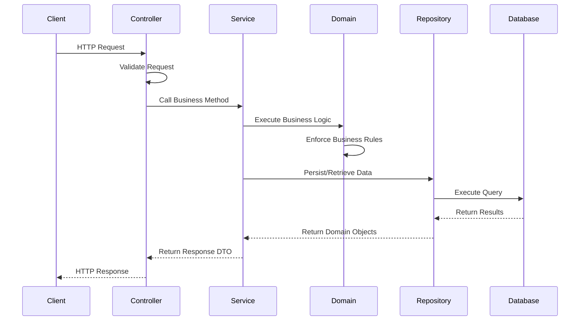
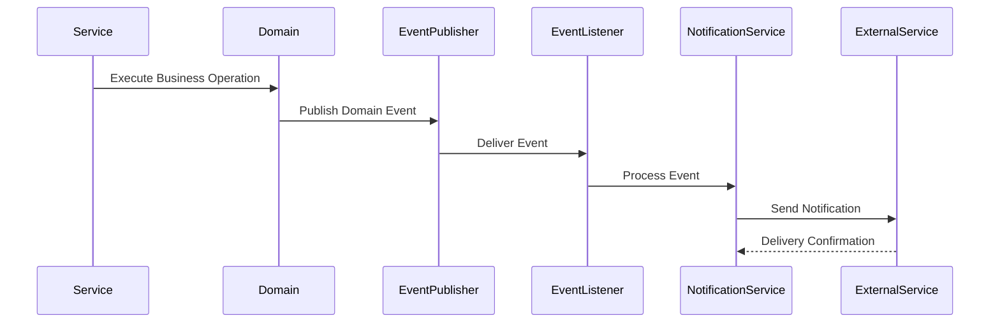
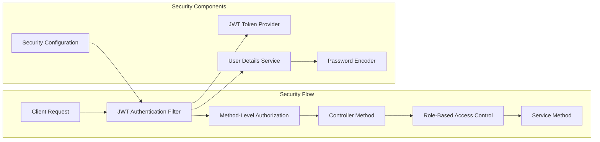
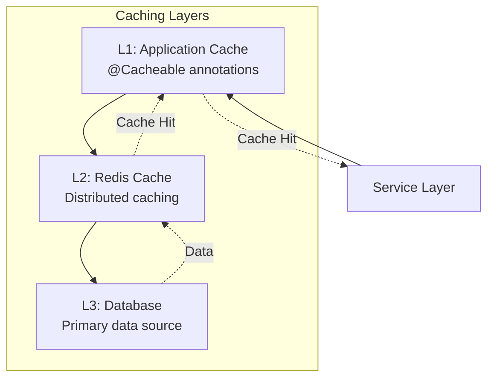
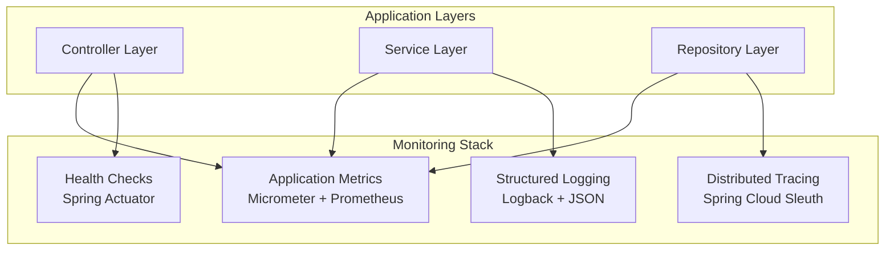
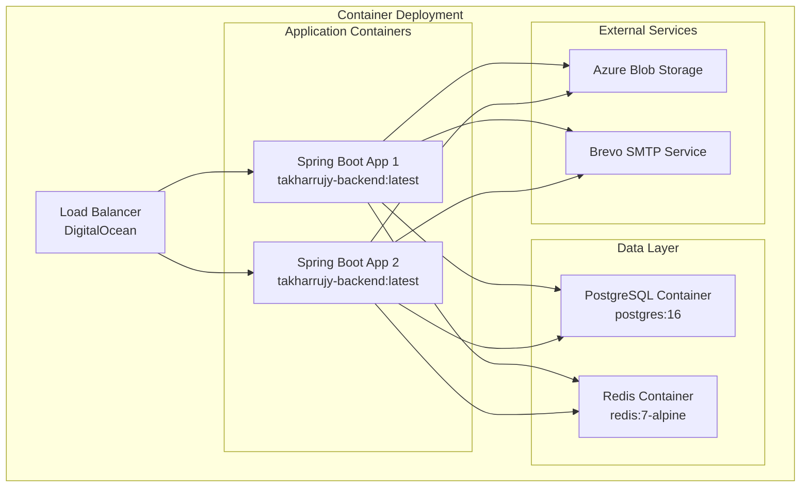

# Takharrujy Platform - Layered Architecture Diagram

**Version:** 1.0  
**Date:** December 2024  
**Project:** Takharrujy (تخرجي) - University Graduation Project Management Platform  
**Framework:** Spring Boot 3.4.x with Java 24  
**Architecture Pattern:** Layered Architecture with Domain-Driven Design  
**Platform URL:** https://takharujy.tech  

## 1. Layered Architecture Overview

The Takharrujy platform implements a **layered architecture** pattern that promotes separation of concerns, maintainability, and testability. Each layer has specific responsibilities and dependencies flow downward only.

### 1.1 Architecture Principles

- **Single Responsibility:** Each layer has a specific purpose
- **Dependency Inversion:** Higher layers depend on abstractions, not implementations
- **Loose Coupling:** Minimal dependencies between layers
- **High Cohesion:** Related functionality grouped together
- **Testability:** Each layer can be tested independently

## 2. Complete Layered Architecture Diagram

```mermaid
graph TB
    subgraph "External Clients"
        WEB[Web Client<br/>React/Next.js]
        MOBILE[Mobile App<br/>Flutter]
        API[External APIs<br/>Third-party]
    end
    
    subgraph "Presentation Layer"
        subgraph "Controllers"
            UC[👤 UserController<br/>+register()<br/>+login()<br/>+getProfile()<br/>+updateProfile()]
            PC[📋 ProjectController<br/>+createProject()<br/>+getProject()<br/>+addTeamMember()<br/>+getProjectStats()]
            TC[✅ TaskController<br/>+createTask()<br/>+updateTask()<br/>+assignTask()<br/>+getProjectTasks()]
            FC[📁 FileController<br/>+uploadFile()<br/>+downloadFile()<br/>+shareFile()<br/>+getFileVersions()]
            NC[🔔 NotificationController<br/>+getUserNotifications()<br/>+markAsRead()<br/>+updatePreferences()]
            MC[💬 MessageController<br/>+sendMessage()<br/>+getProjectMessages()<br/>+searchMessages()]
            AC[⚙️ AdminController<br/>+manageUsers()<br/>+assignSupervisors()<br/>+getSystemStats()]
        end
        
        subgraph "WebSocket Controllers"
            WSM[💬 MessageWebSocketController<br/>+handleMessage()<br/>+broadcastToProject()]
            WSN[🔔 NotificationWebSocketController<br/>+subscribeToNotifications()<br/>+handleRealTimeUpdates()]
        end
        
        subgraph "Cross-Cutting Presentation"
            EH[🚨 GlobalExceptionHandler<br/>+handleValidationErrors()<br/>+handleBusinessExceptions()]
            SEC[🔐 SecurityConfiguration<br/>+configureHttpSecurity()<br/>+jwtAuthenticationFilter()]
            CORS[🌐 CorsConfiguration<br/>+corsConfigurationSource()]
        end
    end
    
    subgraph "Application Service Layer"
        subgraph "Core Business Services"
            US[👤 UserService<br/>+registerUser()<br/>+authenticateUser()<br/>+updateProfile()<br/>+resetPassword()]
            PS[📋 ProjectService<br/>+createProject()<br/>+manageTeam()<br/>+calculateProgress()<br/>+assignSupervisor()]
            TS[✅ TaskService<br/>+createTask()<br/>+updateStatus()<br/>+assignTask()<br/>+trackProgress()]
            FS[📁 FileService<br/>+uploadFile()<br/>+manageVersions()<br/>+shareFile()<br/>+virusScan()]
            NS[🔔 NotificationService<br/>+sendNotification()<br/>+managePreferences()<br/>+batchProcess()]
            MS[💬 MessageService<br/>+sendMessage()<br/>+manageThreads()<br/>+searchMessages()]
            AS[⚙️ AdminService<br/>+manageUniversities()<br/>+assignSupervisors()<br/>+generateReports()]
        end
        
        subgraph "Supporting Services"
            AUTH[🔑 AuthenticationService<br/>+generateJWT()<br/>+validateToken()<br/>+manageSession()]
            VALID[✔️ ValidationService<br/>+validateBusinessRules()<br/>+checkPermissions()]
            AUDIT[📊 AuditService<br/>+logActivity()<br/>+trackChanges()<br/>+generateAuditTrail()]
        end
    end
    
    subgraph "Domain Layer"
        subgraph "Domain Models"
            USER_DOM[👤 User Domain<br/>• User<br/>• University<br/>• Department<br/>• UserRole]
            PROJ_DOM[📋 Project Domain<br/>• Project<br/>• ProjectMember<br/>• ProjectStatus<br/>• ProjectType]
            TASK_DOM[✅ Task Domain<br/>• Task<br/>• TaskDependency<br/>• TaskStatus<br/>• TaskPriority]
            FILE_DOM[📁 File Domain<br/>• File<br/>• FileVersion<br/>• FileShare<br/>• FileStatus]
            NOTIF_DOM[🔔 Notification Domain<br/>• Notification<br/>• NotificationType<br/>• NotificationPreference]
            MSG_DOM[💬 Message Domain<br/>• Message<br/>• MessageThread<br/>• MessageReaction]
        end
        
        subgraph "Domain Services"
            PROJ_DS[📋 ProjectDomainService<br/>+validateProjectRules()<br/>+calculateTeamCapacity()]
            TASK_DS[✅ TaskDomainService<br/>+validateDependencies()<br/>+calculateProgress()]
            FILE_DS[📁 FileDomainService<br/>+validateFileRules()<br/>+manageVersioning()]
        end
        
        subgraph "Domain Events"
            EVENTS[📡 Domain Events<br/>• ProjectCreatedEvent<br/>• TaskAssignedEvent<br/>• FileUploadedEvent<br/>• DeadlineApproachingEvent]
        end
    end
    
    subgraph "Infrastructure Layer"
        subgraph "Data Access"
            USER_REPO[👤 UserRepository<br/>+findByEmail()<br/>+findByUniversity()<br/>+save()<br/>+delete()]
            PROJ_REPO[📋 ProjectRepository<br/>+findByUser()<br/>+findBySupervisor()<br/>+findByStatus()<br/>+save()]
            TASK_REPO[✅ TaskRepository<br/>+findByProject()<br/>+findByAssignee()<br/>+findOverdue()<br/>+save()]
            FILE_REPO[📁 FileRepository<br/>+findByProject()<br/>+findByHash()<br/>+findVersions()<br/>+save()]
            NOTIF_REPO[🔔 NotificationRepository<br/>+findByUser()<br/>+findUnread()<br/>+markAsRead()<br/>+save()]
            MSG_REPO[💬 MessageRepository<br/>+findByProject()<br/>+findByThread()<br/>+searchContent()<br/>+save()]
        end
        
        subgraph "External Integrations"
            AZURE[☁️ AzureBlobStorageService<br/>+uploadFile()<br/>+downloadFile()<br/>+generatePresignedUrl()]
            BREVO[📧 BrevoEmailService<br/>+sendEmail()<br/>+sendBulkEmail()<br/>+trackDelivery()]
            VIRUS[🛡️ VirusScanService<br/>+scanFile()<br/>+quarantineFile()<br/>+getReport()]
            CACHE[⚡ RedisCacheService<br/>+get()<br/>+set()<br/>+evict()<br/>+exists()]
        end
        
        subgraph "Infrastructure Services"
            JWT[🔑 JwtTokenProvider<br/>+generateToken()<br/>+validateToken()<br/>+extractClaims()]
            WEBSOCKET[🔌 WebSocketService<br/>+sendToUser()<br/>+broadcastToProject()<br/>+manageConnections()]
            SCHEDULER[⏰ SchedulerService<br/>+scheduleDeadlineReminders()<br/>+cleanupExpiredSessions()]
        end
    end
    
    subgraph "Configuration Layer"
        DB_CONFIG[🗄️ DatabaseConfiguration<br/>+dataSource()<br/>+entityManagerFactory()<br/>+transactionManager()]
        CACHE_CONFIG[⚡ CacheConfiguration<br/>+cacheManager()<br/>+redisTemplate()<br/>+cacheConfigurations()]
        WS_CONFIG[🔌 WebSocketConfiguration<br/>+configureMessageBroker()<br/>+registerStompEndpoints()]
        ASYNC_CONFIG[🔄 AsyncConfiguration<br/>+taskExecutor()<br/>+eventMulticaster()]
        INTEGRATION_CONFIG[🔗 IntegrationConfiguration<br/>+azureStorageClient()<br/>+emailService()<br/>+virusScanClient()]
    end
    
    subgraph "Data Layer"
        POSTGRES[(🗄️ PostgreSQL Database<br/>• Primary data storage<br/>• ACID transactions<br/>• Row-level security)]
        REDIS[(⚡ Redis Cache<br/>• Session storage<br/>• Caching layer<br/>• Real-time data)]
    end
    
    subgraph "External Services"
        AZURE_BLOB[☁️ Azure Blob Storage<br/>File storage and CDN]
        BREVO_SMTP[📧 Brevo SMTP<br/>Email delivery service]
        VIRUS_SCAN[🛡️ Virus Scanning API<br/>File security scanning]
    end
    
    %% Client connections
    WEB --> UC
    WEB --> PC
    WEB --> TC
    WEB --> FC
    MOBILE --> UC
    MOBILE --> PC
    MOBILE --> TC
    API --> UC
    
    %% WebSocket connections
    WEB --> WSM
    MOBILE --> WSN
    
    %% Controller to Service connections
    UC --> US
    PC --> PS
    TC --> TS
    FC --> FS
    NC --> NS
    MC --> MS
    AC --> AS
    
    %% WebSocket Controller connections
    WSM --> MS
    WSN --> NS
    
    %% Service to Service connections
    US --> AUTH
    PS --> VALID
    TS --> AUDIT
    FS --> VALID
    NS --> AUDIT
    
    %% Service to Domain connections
    US --> USER_DOM
    PS --> PROJ_DOM
    PS --> PROJ_DS
    TS --> TASK_DOM
    TS --> TASK_DS
    FS --> FILE_DOM
    FS --> FILE_DS
    NS --> NOTIF_DOM
    MS --> MSG_DOM
    
    %% Domain Events
    PROJ_DOM --> EVENTS
    TASK_DOM --> EVENTS
    FILE_DOM --> EVENTS
    
    %% Service to Repository connections
    US --> USER_REPO
    PS --> PROJ_REPO
    TS --> TASK_REPO
    FS --> FILE_REPO
    NS --> NOTIF_REPO
    MS --> MSG_REPO
    
    %% Service to Infrastructure connections
    FS --> AZURE
    NS --> BREVO
    FS --> VIRUS
    US --> CACHE
    PS --> CACHE
    
    %% Infrastructure connections
    US --> JWT
    MS --> WEBSOCKET
    NS --> SCHEDULER
    
    %% Repository to Database connections
    USER_REPO --> POSTGRES
    PROJ_REPO --> POSTGRES
    TASK_REPO --> POSTGRES
    FILE_REPO --> POSTGRES
    NOTIF_REPO --> POSTGRES
    MSG_REPO --> POSTGRES
    
    %% Cache connections
    CACHE --> REDIS
    JWT --> REDIS
    
    %% External service connections
    AZURE --> AZURE_BLOB
    BREVO --> BREVO_SMTP
    VIRUS --> VIRUS_SCAN
    
    %% Configuration connections
    DB_CONFIG --> POSTGRES
    CACHE_CONFIG --> REDIS
    WS_CONFIG --> WEBSOCKET
    ASYNC_CONFIG --> SCHEDULER
    INTEGRATION_CONFIG --> AZURE
    INTEGRATION_CONFIG --> BREVO
    INTEGRATION_CONFIG --> VIRUS
    
    %% Cross-cutting concerns
    EH -.-> UC
    EH -.-> PC
    EH -.-> TC
    EH -.-> FC
    SEC -.-> UC
    SEC -.-> PC
    SEC -.-> TC
    SEC -.-> FC
    CORS -.-> UC
    CORS -.-> PC
```

## 3. Layer Responsibilities

### 3.1 Presentation Layer
**Purpose:** Handle HTTP requests, WebSocket connections, and user interactions

**Components:**
- **REST Controllers:** Process HTTP requests and return responses
- **WebSocket Controllers:** Handle real-time communication
- **Exception Handlers:** Centralized error handling and response formatting
- **Security Configuration:** Authentication, authorization, and CORS
- **Request/Response DTOs:** Data transfer objects for API communication

**Key Responsibilities:**
- Request validation and sanitization
- Response formatting and serialization
- Authentication and authorization enforcement
- Real-time communication management
- API documentation and versioning

### 3.2 Application Service Layer
**Purpose:** Orchestrate business workflows and coordinate domain operations

**Components:**
- **Core Business Services:** Implement use cases and business workflows
- **Supporting Services:** Cross-cutting concerns like authentication and validation
- **Application Events:** Handle domain events and trigger side effects

**Key Responsibilities:**
- Business workflow orchestration
- Transaction management
- Domain event publishing and handling
- External service integration
- Application-level validation and security

### 3.3 Domain Layer
**Purpose:** Encapsulate business logic and domain rules

**Components:**
- **Domain Models:** Core business entities with behavior
- **Domain Services:** Complex business logic that doesn't belong to entities
- **Domain Events:** Business events that trigger side effects
- **Value Objects:** Immutable objects representing domain concepts

**Key Responsibilities:**
- Business rule enforcement
- Domain model integrity
- Business logic encapsulation
- Domain event generation
- Aggregate root management

### 3.4 Infrastructure Layer
**Purpose:** Provide technical capabilities and external integrations

**Components:**
- **Repositories:** Data access and persistence
- **External Services:** Third-party integrations (Azure, Brevo, etc.)
- **Infrastructure Services:** Technical services (JWT, WebSocket, etc.)
- **Caching:** Performance optimization through Redis

**Key Responsibilities:**
- Data persistence and retrieval
- External service communication
- Caching and performance optimization
- Technical infrastructure management
- Cross-cutting technical concerns

### 3.5 Configuration Layer
**Purpose:** Configure and wire application components

**Components:**
- **Database Configuration:** Data source and JPA setup
- **Cache Configuration:** Redis and caching strategies
- **Integration Configuration:** External service clients
- **Security Configuration:** Authentication and authorization setup

**Key Responsibilities:**
- Dependency injection configuration
- External service client setup
- Environment-specific configurations
- Bean lifecycle management

## 4. Data Flow Patterns

### 4.1 Request Processing Flow



### 4.2 Event-Driven Flow



## 5. Cross-Cutting Concerns

### 5.1 Security Architecture



### 5.2 Caching Strategy



## 6. Performance Considerations

### 6.1 Scalability Patterns

**Horizontal Scaling:**
- Stateless service design
- Redis for shared session storage
- Database connection pooling
- Load balancer distribution

**Vertical Scaling:**
- Virtual threads (Java 24)
- Async processing patterns
- Connection pool optimization
- Memory management tuning

### 6.2 Monitoring and Observability



## 7. Testing Strategy by Layer

### 7.1 Testing Pyramid

```mermaid
graph TB
    subgraph "Testing Layers"
        E2E[E2E Tests<br/>Full system integration<br/>10%]
        INTEGRATION[Integration Tests<br/>Layer integration<br/>20%]
        UNIT[Unit Tests<br/>Individual components<br/>70%]
    end
    
    subgraph "Test Types by Layer"
        CONTROLLER_TEST[Controller Tests<br/>@WebMvcTest<br/>MockMvc]
        SERVICE_TEST[Service Tests<br/>@ExtendWith(MockitoExtension)<br/>Mock dependencies]
        REPOSITORY_TEST[Repository Tests<br/>@DataJpaTest<br/>TestContainers]
        DOMAIN_TEST[Domain Tests<br/>Pure unit tests<br/>No frameworks]
    end
    
    E2E --> CONTROLLER_TEST
    INTEGRATION --> SERVICE_TEST
    INTEGRATION --> REPOSITORY_TEST
    UNIT --> DOMAIN_TEST
```

## 8. Deployment Architecture

### 8.1 Container Architecture



## 9. Development Guidelines

### 9.1 Layer Communication Rules

**✅ Allowed Dependencies:**
- Presentation → Application Service
- Application Service → Domain
- Application Service → Infrastructure
- Infrastructure → External Services
- Configuration → All Layers

**❌ Forbidden Dependencies:**
- Domain → Infrastructure
- Domain → Application Service
- Infrastructure → Application Service
- Lower Layer → Higher Layer

### 9.2 Code Organization

```
src/main/java/com/university/takharrujy/
├── presentation/           # Controllers, DTOs, Exception Handlers
│   ├── controller/
│   ├── dto/
│   ├── exception/
│   └── websocket/
├── application/           # Application Services, Events
│   ├── service/
│   ├── event/
│   └── mapper/
├── domain/               # Domain Models, Services, Events
│   ├── model/
│   ├── service/
│   ├── event/
│   └── repository/
├── infrastructure/       # Repositories, External Services
│   ├── repository/
│   ├── external/
│   ├── cache/
│   └── messaging/
└── configuration/        # Spring Configuration Classes
    ├── database/
    ├── security/
    ├── cache/
    └── integration/
```

---

**Layered Architecture Document Status:** Active Development  
**Complements:** UML Class Diagrams and ERD  
**Framework Version:** Spring Boot 3.4.x  
**Architecture Pattern:** Layered + DDD  
**Last Updated:** December 2024

This layered architecture diagram provides the structural foundation that complements the detailed UML class diagrams, giving you both the **"how it's organized"** and **"what each component does"** perspectives needed for successful implementation.
