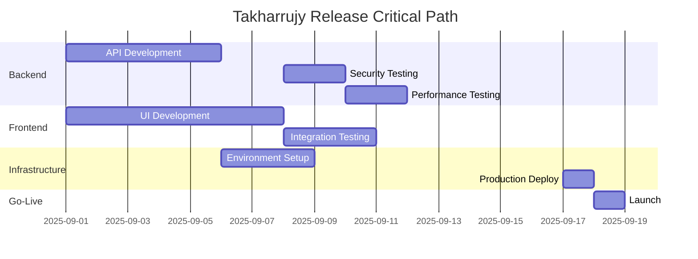

# Takharrujy Platform - Release Plan

**Version:** 1.0  
**Date:** September 2025  
**Project:** Takharrujy (تخرجي) - University Graduation Project Management Platform  
**Production URL:** https://takharujy.tech  
**API Base URL:** https://api.takharujy.tech/v1  

## 1. Release Overview

### 1.1 Release Strategy

**Release Type:** MVP (Minimum Viable Product) Launch  
**Release Model:** Big Bang Deployment with Phased User Onboarding  
**Target Date:** End of Sprint 1.5 (Week 3)  
**Deployment Window:** Friday evening (low university activity)  

### 1.2 Release Objectives

**Primary Goals:**
- Launch core platform functionality for final-year university students
- Establish foundation for graduation project management in MENA universities
- Demonstrate value proposition to target universities for institutional adoption
- Gather user feedback for iterative improvement in subsequent releases

**Success Metrics:**
- Platform accessible at https://takharujy.tech with 99.9% uptime
- Successful user registration and project creation workflows
- 25+ active student users within first week
- 3+ supervisor users providing feedback on platform usability
- Zero critical bugs reported in first 48 hours post-launch

### 1.3 Release Scope

**Included Features (MVP):**
- User authentication and role-based access control
- Project creation and team management
- Task assignment and progress tracking
- File upload and document sharing
- Basic messaging and notification system
- Supervisor dashboard for project oversight
- Arabic/English bilingual interface

**Deferred Features (Post-MVP):**
- AI-powered academic assistant
- Advanced analytics and reporting
- Real-time collaborative editing
- Mobile push notifications
- Third-party integration (LMS, Calendar)

## 2. Release Timeline and Milestones

### 2.1 Sprint 1.5 Release Schedule

**Week 1: Development Completion (Days 1-5)**

| Day | Activity | Owner | Deliverables | Success Criteria |
|-----|----------|-------|--------------|------------------|
| Mon | Backend API finalization | Backend Team | All endpoints functional | API test suite passes |
| Tue | Frontend integration | Frontend Team | Web app connected to API | User workflows functional |
| Wed | Mobile app core features | Mobile Team | Flutter app basic functionality | Login and project creation work |
| Thu | Integration testing | All Teams | Cross-platform testing | No integration failures |
| Fri | Sprint 1 demo and review | Product Owner | Stakeholder presentation | Feature approval received |

**Week 2: Testing and Hardening (Days 6-10)**

| Day | Activity | Owner | Deliverables | Success Criteria |
|-----|----------|-------|--------------|------------------|
| Mon | Security testing and penetration testing | Backend Team | Security audit report | No high-severity vulnerabilities |
| Tue | Performance testing and optimization | Backend Team | Load testing results | 500 concurrent users supported |
| Wed | User acceptance testing | QA Team | UAT test results | All critical paths validated |
| Thu | Bug fixes and final polish | All Teams | Production-ready code | All P1/P2 bugs resolved |
| Fri | Pre-release deployment to staging | DevOps | Staging environment live | Staging mirrors production |

**Week 3: Release Execution (Days 11-15)**

| Day | Activity | Owner | Deliverables | Success Criteria |
|-----|----------|-------|--------------|------------------|
| Mon | Final security review | Security Team | Security sign-off | Compliance requirements met |
| Tue | Production deployment preparation | DevOps | Deployment scripts ready | All environments configured |
| Wed | Production deployment | DevOps + Backend | Live production system | All services operational |
| Thu | Post-deployment validation | All Teams | System health check | All functionality verified |
| Fri | Go-live announcement and monitoring | Product Owner | Public platform launch | Users can access and register |

### 2.2 Critical Path Dependencies



## 3. Deployment Architecture

### 3.1 Production Environment Specifications

**Primary Infrastructure (DigitalOcean):**
- **Application Server:** DigitalOcean App Platform (2GB RAM, 1 vCPU)
- **Database:** DigitalOcean Managed PostgreSQL (4GB RAM, 2 vCPU)
- **Cache:** DigitalOcean Managed Redis (1GB RAM)
- **Load Balancer:** DigitalOcean Load Balancer with SSL termination
- **CDN:** DigitalOcean Spaces CDN for static assets

**Secondary Services:**
- **File Storage:** Azure Blob Storage (primary) with DigitalOcean Spaces (backup)
- **Email Service:** Brevo SMTP (smtp-relay.brevo.com)
- **Monitoring:** DigitalOcean Monitoring + Custom dashboards
- **DNS:** DigitalOcean DNS with takharujy.tech domain

### 3.2 Deployment Process

#### 3.2.1 Blue-Green Deployment Strategy

**Green Environment (Current Production):**
```
takharujy.tech → Load Balancer → Green App Instances
                                  ↓
                               Shared Database
                               Shared Redis Cache
```

**Blue Environment (New Release):**
```
blue.takharujy.tech → Load Balancer → Blue App Instances
                                       ↓
                                  Shared Database
                                  Shared Redis Cache
```

#### 3.2.2 Deployment Steps

```yaml
# Automated Deployment Script
deployment_steps:
  pre_deployment:
    - name: "Database Backup"
      command: "pg_dump takharujy_prod > backup_$(date +%Y%m%d_%H%M%S).sql"
      rollback: "Restore from backup if needed"
    
    - name: "Blue Environment Preparation"
      command: "kubectl apply -f blue-deployment.yaml"
      verify: "curl https://blue.takharujy.tech/health"
    
    - name: "Database Migrations"
      command: "flyway migrate -url=jdbc:postgresql://db.takharujy.tech"
      rollback: "flyway undo -url=jdbc:postgresql://db.takharujy.tech"
  
  deployment:
    - name: "Traffic Switch to Blue"
      command: "kubectl patch ingress main --patch '{\"spec\":{\"rules\":[{\"host\":\"takharujy.tech\",\"http\":{\"paths\":[{\"path\":\"/\",\"backend\":{\"serviceName\":\"blue-service\"}}]}}]}}'"
      verify: "curl https://takharujy.tech/health"
    
    - name: "Smoke Tests"
      command: "npm run smoke-tests"
      rollback: "Switch back to green if tests fail"
  
  post_deployment:
    - name: "Health Check Monitoring"
      command: "monitor-health-metrics.sh"
      duration: "30 minutes"
    
    - name: "Green Environment Cleanup"
      command: "kubectl delete deployment green-app"
      condition: "After 24 hours of stable operation"
```

### 3.3 Environment Configuration

**Production Environment Variables:**
```bash
# Application Configuration
SPRING_PROFILES_ACTIVE=production
SERVER_PORT=8080
MANAGEMENT_ENDPOINTS_WEB_EXPOSURE_INCLUDE=health,info,metrics

# Database Configuration
DATABASE_URL=jdbc:postgresql://db-takharujy-prod.postgres.ondigitalocean.com:25060/takharujy
DATABASE_USER=takharujy_prod
DATABASE_PASSWORD=${DB_PASSWORD_SECRET}
DATABASE_MAX_CONNECTIONS=20

# Redis Configuration
REDIS_HOST=redis-takharujy-prod.redis.ondigitalocean.com
REDIS_PORT=25061
REDIS_PASSWORD=${REDIS_PASSWORD_SECRET}
REDIS_SSL=true

# File Storage Configuration
FILE_STORAGE_PROVIDER=azure
AZURE_STORAGE_CONNECTION_STRING=${AZURE_STORAGE_SECRET}
AZURE_CONTAINER_NAME=takharujy-prod-files

# Email Configuration
EMAIL_PROVIDER=brevo
BREVO_SMTP_SERVER=smtp-relay.brevo.com
BREVO_SMTP_PORT=587
BREVO_SMTP_USERNAME=${BREVO_SMTP_USERNAME_SECRET}
BREVO_SMTP_KEY=${BREVO_SMTP_KEY_SECRET}
BREVO_FROM_EMAIL=donotreply@takharujy.tech
BREVO_FROM_NAME=Takharrujy Platform

# Security Configuration
JWT_SECRET=${JWT_SECRET_KEY}
CORS_ALLOWED_ORIGINS=https://takharujy.tech,https://www.takharujy.tech

# Monitoring Configuration
SENTRY_DSN=${SENTRY_DSN_SECRET}
LOG_LEVEL=INFO
```

## 4. Go-to-Market Strategy

### 4.1 Launch Phases

#### 4.1.1 Phase 1: Closed Beta (Week 3)
**Target Audience:** Internal team and close university contacts  
**User Limit:** 10 students, 3 supervisors, 1 admin  
**Duration:** 1 week  
**Success Criteria:** All core workflows function without critical bugs

```markdown
**Closed Beta Checklist:**
- [ ] Internal team testing completed
- [ ] University partner contact identified
- [ ] Beta user accounts created
- [ ] Feedback collection process established
- [ ] Support contact information provided
```

#### 4.1.2 Phase 2: Limited Public Launch (Week 4)
**Target Audience:** Final-year students from partner universities  
**User Limit:** 50 students, 10 supervisors, 3 admins  
**Duration:** 2 weeks  
**Success Criteria:** User feedback positive, no system stability issues

#### 4.1.3 Phase 3: Open Public Launch (Week 6)
**Target Audience:** All qualified university users  
**User Limit:** No limit (with monitoring)  
**Duration:** Ongoing  
**Success Criteria:** Sustainable user growth, system scalability proven

### 4.2 Marketing and Communication Strategy

#### 4.2.1 Pre-Launch Communications

**Internal Stakeholders (1 week before):**
```markdown
**Email Template - Internal Announcement**
Subject: 🚀 Takharrujy Platform Launch - Final Week Preparations

Dear Team,

We are now in the final week before launching Takharrujy (takharujy.tech), 
our graduation project management platform. 

**Launch Date:** [Specific Date]
**Launch Time:** Friday 6:00 PM GMT+2 (after university hours)

**Final Preparations:**
- All hands testing session: Wednesday 2:00 PM
- Go/No-Go decision meeting: Friday 3:00 PM
- Launch monitoring shifts assigned

Please ensure your systems are ready and contact information updated.

Best regards,
Takharrujy Launch Team
```

**University Partners (3 days before):**
```markdown
**Email Template - Partner University Notification**
Subject: New Graduation Project Platform Launch - Takharrujy

Dear [University Contact],

We are excited to announce the launch of Takharrujy (takharujy.tech), 
a specialized platform for managing graduation projects.

**Platform Benefits:**
- Streamlined project collaboration
- Arabic/English bilingual support
- Supervisor oversight tools
- Academic workflow integration

**Launch Date:** [Date]
**Beta Access:** [Special invitation link]

We would appreciate your feedback during our initial launch phase.

Looking forward to supporting your students' success.

Best regards,
Takharrujy Team
```

#### 4.2.2 Launch Day Communications

**Public Announcement:**
```markdown
**Social Media Post Template**
🎓 Introducing Takharrujy (تخرجي) - The graduation project platform built for MENA universities!

✅ Team collaboration tools
✅ Supervisor communication
✅ Arabic & English support  
✅ File sharing & organization
✅ Task management

Join us at takharujy.tech and revolutionize your graduation project experience!

#GraduationProject #UniversityLife #MENA #Education #تخرج
```

**User Onboarding Email:**
```markdown
**Welcome Email Template**
Subject: Welcome to Takharrujy - Let's get your graduation project organized! 

مرحباً بك في منصة تخرجي

Dear [Student Name],

Welcome to Takharrujy! We're excited to help you manage your graduation project successfully.

**Getting Started:**
1. Complete your profile at takharujy.tech/profile  
2. Create or join a project team
3. Set up your project timeline
4. Invite your supervisor

**Need Help?**
- Platform Guide: takharujy.tech/guide
- Video Tutorials: takharujy.tech/tutorials  
- Support: support@takharujy.tech

Best of luck with your graduation project!
Takharrujy Team
```

### 4.3 User Onboarding Strategy

#### 4.3.1 First-Time User Experience

**Registration Flow:**
1. **Landing Page** → Value proposition and registration CTA
2. **Email Verification** → University email domain validation
3. **Profile Setup** → Role selection and basic information
4. **Guided Tour** → Interactive platform introduction
5. **First Action** → Create project or join existing team

**Onboarding Metrics:**
- Registration completion rate: Target >80%
- Time to first project creation: Target <10 minutes
- User activation (completing first task): Target >60%

#### 4.3.2 Progressive Feature Introduction

**Week 1 Features (Core):**
- Project creation and team invitation
- Basic task management
- File upload and sharing

**Week 2 Features (Enhanced):**
- Real-time messaging
- Supervisor feedback system
- Notification preferences

**Week 3+ Features (Advanced):**
- Progress analytics
- Calendar integration
- Advanced collaboration tools

## 5. Risk Management and Contingency Plans

### 5.1 Release Risk Assessment

| Risk Category | Risk Description | Probability | Impact | Mitigation Strategy |
|---------------|------------------|-------------|--------|---------------------|
| **Technical** | Database performance degradation | Medium | High | Database optimization, connection pooling, read replicas |
| **Technical** | File upload service failure | Low | Medium | Fallback to secondary storage provider (DigitalOcean) |
| **Security** | Authentication bypass discovered | Low | Critical | Immediate rollback, security patch deployment |
| **User Experience** | Arabic text display issues | Medium | Medium | Extensive RTL testing, fallback to English |
| **Infrastructure** | DigitalOcean service outage | Low | High | Multi-region backup, rapid provider switch |
| **Business** | Low user adoption rate | High | Medium | Enhanced marketing, feature adjustments |

### 5.2 Rollback Procedures

#### 5.2.1 Immediate Rollback (< 30 minutes)

**Trigger Conditions:**
- Critical security vulnerability detected
- Authentication system completely non-functional
- Data corruption or loss detected
- Site completely inaccessible

**Rollback Process:**
```bash
#!/bin/bash
# Emergency Rollback Script
echo "EMERGENCY ROLLBACK INITIATED"

# 1. Switch traffic back to previous version
kubectl patch ingress main --patch '{"spec":{"rules":[{"host":"takharujy.tech","http":{"paths":[{"path":"/","backend":{"serviceName":"green-service"}}]}}]}}'

# 2. Verify rollback
curl -f https://takharujy.tech/health || exit 1

# 3. Database rollback if needed
psql -d takharujy_prod -c "SELECT version();" # Check if rollback needed

# 4. Notify team
curl -X POST $SLACK_WEBHOOK -d '{"text":"🚨 EMERGENCY ROLLBACK COMPLETED - takharujy.tech"}'

echo "ROLLBACK COMPLETED - System restored to previous version"
```

#### 5.2.2 Planned Rollback (1-4 hours)

**Trigger Conditions:**
- Multiple non-critical bugs affecting user experience
- Performance significantly below acceptable levels
- User feedback indicates major usability issues

**Rollback Process:**
1. **Assessment Phase (30 minutes):** Evaluate issue severity and fix feasibility
2. **Communication Phase (15 minutes):** Notify users of temporary rollback
3. **Rollback Execution (30 minutes):** Systematic rollback to previous version
4. **Verification Phase (30 minutes):** Comprehensive testing of restored system
5. **Resolution Planning (Variable):** Plan fix deployment for identified issues

### 5.3 Incident Response Plan

#### 5.3.1 Incident Severity Levels

**P1 - Critical (Response: Immediate)**
- Complete system outage
- Authentication/security breaches
- Data loss or corruption

**P2 - High (Response: < 2 hours)**
- Major functionality unavailable
- Performance severely degraded
- Multiple user reports of same issue

**P3 - Medium (Response: < 8 hours)**
- Minor functionality issues
- Individual user problems
- Cosmetic bugs

#### 5.3.2 Incident Response Team

| Role | Primary | Secondary | Responsibilities |
|------|---------|-----------|------------------|
| **Incident Commander** | Product Owner | Technical Lead | Overall incident coordination, communication |
| **Technical Lead** | Senior Developer 1 | Senior Developer 2 | Technical investigation, fix implementation |
| **Communications Lead** | Product Owner | Junior Developer | User communication, status updates |
| **Infrastructure Lead** | DevOps Engineer | Senior Developer 1 | Server monitoring, scaling, performance |

#### 5.3.3 Communication Templates

**User Communication - Service Disruption:**
```markdown
**Status Page Update Template**
🔧 Service Notice: Takharrujy Platform

We are currently experiencing [brief description of issue] affecting [affected features].

**Current Status:** Investigating
**Affected Services:** [List specific features]
**Estimated Resolution:** [Time estimate]
**Workaround:** [If available]

We apologize for the inconvenience and will provide updates every 30 minutes.

Updates: https://status.takharujy.tech
Support: support@takharujy.tech
```

## 6. Post-Release Support and Monitoring

### 6.1 Production Monitoring Strategy

#### 6.1.1 System Health Monitoring

**Key Metrics Dashboard:**
```yaml
monitoring_metrics:
  availability:
    - name: "Platform Uptime"
      target: ">99.9%"
      alert_threshold: "<99.5%"
    
    - name: "API Response Time"
      target: "<2000ms p95"
      alert_threshold: ">3000ms p95"
  
  performance:
    - name: "Database Query Time"
      target: "<100ms average"
      alert_threshold: ">500ms average"
    
    - name: "File Upload Success Rate"
      target: ">99%"
      alert_threshold: "<95%"
  
  user_experience:
    - name: "Page Load Time"
      target: "<3s"
      alert_threshold: ">5s"
    
    - name: "Error Rate"
      target: "<1%"
      alert_threshold: ">5%"
```

**Monitoring Tools:**
- **Application Performance:** Sentry for error tracking and performance monitoring
- **Infrastructure:** DigitalOcean Monitoring for server metrics
- **Uptime:** UptimeRobot for external availability monitoring
- **User Analytics:** Google Analytics for user behavior tracking

#### 6.1.2 Alert Configuration

**Critical Alerts (Immediate SMS/Call):**
- Platform completely down (>2 minutes)
- Database connection failures
- Security-related errors
- Authentication system failures

**Warning Alerts (Email/Slack):**
- Response time degradation
- Error rate increase
- File storage issues
- Email delivery failures

### 6.2 Support Structure

#### 6.2.1 Support Channels

**Primary Support:** support@takharujy.tech
- Response time: <4 hours during business hours
- Available: Sunday-Thursday 9:00 AM - 6:00 PM GMT+2
- Language: Arabic and English

**Secondary Support:** In-app help system
- Contextual help for each platform feature
- Video tutorials for common tasks
- FAQ section covering typical user questions

**Community Support:** Future consideration
- User forum for peer-to-peer help
- University-specific support groups

#### 6.2.2 Support Escalation Matrix

| Issue Type | Level 1 (Support) | Level 2 (Technical) | Level 3 (Engineering) |
|------------|-------------------|---------------------|----------------------|
| **Account Issues** | ✅ Password resets, profile updates | ❌ | ❌ |
| **Feature Questions** | ✅ Usage guidance, tutorials | ❌ | ❌ |
| **Technical Problems** | ✅ Basic troubleshooting | ✅ Advanced diagnosis | ❌ |
| **Bug Reports** | ✅ Initial triage | ✅ Reproduction and analysis | ✅ Code fixes |
| **Performance Issues** | ❌ | ✅ Investigation | ✅ Optimization |
| **Security Concerns** | ❌ | ❌ | ✅ Immediate response |

### 6.3 Feedback Collection and Analysis

#### 6.3.1 User Feedback Mechanisms

**In-App Feedback:**
- Rating system for key workflows (1-5 stars)
- Optional comment field for detailed feedback
- Feature request submission form

**User Surveys:**
- Weekly Net Promoter Score (NPS) survey
- Monthly detailed usability survey
- Semester-end comprehensive platform evaluation

**Analytics Tracking:**
```javascript
// User Behavior Analytics
analytics.track('project_created', {
  userId: user.id,
  projectType: project.type,
  teamSize: project.members.length,
  university: user.university,
  timeToComplete: completionTime
});

analytics.track('feature_used', {
  feature: 'file_upload',
  success: uploadSuccess,
  fileSize: file.size,
  fileType: file.type,
  timeToUpload: uploadTime
});
```

#### 6.3.2 Feedback Analysis Process

**Weekly Reviews:**
- Support ticket analysis for common issues
- User behavior data review
- Performance metrics assessment
- Bug report prioritization

**Monthly Reviews:**
- Feature usage analytics
- User satisfaction scores
- Competitive analysis update
- Roadmap adjustments

## 7. Success Metrics and KPIs

### 7.1 Launch Success Criteria

#### 7.1.1 Technical Success Metrics

| Metric | Target | Measurement Period | Success Threshold |
|--------|--------|--------------------|------------------|
| **Platform Uptime** | >99.5% | First 30 days | ✅ >99.0% |
| **Average Response Time** | <2s | First 30 days | ✅ <3s |
| **Zero Data Loss Events** | 0 incidents | First 30 days | ✅ 0 incidents |
| **Security Incidents** | 0 critical | First 30 days | ✅ 0 critical |
| **API Error Rate** | <2% | First 30 days | ✅ <5% |

#### 7.1.2 User Adoption Metrics

| Metric | Week 1 Target | Week 4 Target | Week 8 Target | Success Indicator |
|--------|---------------|---------------|---------------|------------------|
| **Registered Users** | 25 | 100 | 250 | ✅ Steady growth |
| **Active Projects** | 5 | 25 | 60 | ✅ User engagement |
| **Daily Active Users** | 10 | 30 | 75 | ✅ Platform stickiness |
| **User Retention (7-day)** | 60% | 70% | 75% | ✅ Value realization |
| **Feature Adoption Rate** | 80% | 85% | 90% | ✅ Intuitive design |

#### 7.1.3 Business Success Metrics

| Metric | Target | Measurement | Success Criteria |
|--------|--------|-------------|------------------|
| **University Partnerships** | 3 universities | First semester | ✅ 2+ confirmed partners |
| **User Satisfaction (NPS)** | >50 | Monthly survey | ✅ >30 considered success |
| **Support Ticket Volume** | <5 per day | Daily average | ✅ Manageable load |
| **Critical Bug Reports** | <1 per week | Weekly tracking | ✅ Quality threshold |

### 7.2 Long-term Success Indicators

**3-Month Goals:**
- 500+ registered users across multiple universities
- 100+ active graduation projects
- <2% monthly churn rate
- Partnership agreements with 5+ universities

**6-Month Goals:**
- 1,000+ users with sustainable growth trajectory
- AI assistant feature launched and adopted by >60% of users
- Revenue model validated through institutional subscriptions
- Platform expansion to 3+ additional countries in MENA

## 8. Post-Launch Roadmap

### 8.1 Immediate Priorities (Weeks 1-4)

**Week 1-2: Stabilization**
- Monitor system performance and fix any stability issues
- Address user-reported bugs and usability problems
- Optimize performance based on real usage patterns
- Enhanced monitoring and alerting implementation

**Week 3-4: Enhancement**
- Real-time collaboration features improvement
- Mobile app performance optimization
- Advanced notification system implementation
- User onboarding flow refinement

### 8.2 Short-term Development (Months 2-3)

**AI Integration Phase:**
- AI academic assistant development and testing
- Intelligent task suggestions and project insights
- Automated report generation assistance
- Smart deadline and milestone recommendations

**Platform Enhancement:**
- Advanced analytics dashboard for supervisors
- Bulk operations for administrators
- Integration with popular university LMS systems
- Enhanced mobile app with offline capabilities

### 8.3 Medium-term Expansion (Months 4-6)

**Market Expansion:**
- Multi-tenant architecture for institutional deployment
- White-label solutions for universities
- Advanced reporting and compliance features
- API ecosystem for third-party integrations

**Feature Development:**
- Plagiarism detection integration
- Video conferencing and presentation tools
- Advanced project templates and workflows
- Peer review and collaboration features

## 9. Release Documentation and Knowledge Transfer

### 9.1 Technical Documentation

**Deployment Documentation:**
- Production environment setup and configuration
- Database schema and migration procedures
- Monitoring and alerting configuration
- Backup and disaster recovery procedures

**Operations Runbook:**
- Common troubleshooting procedures
- System maintenance tasks and schedules
- Performance optimization guidelines
- Security audit and compliance checklists

### 9.2 User Documentation

**End-User Guides:**
- Student platform guide (Arabic/English)
- Supervisor dashboard guide
- Administrator management guide
- Mobile app user manual

**Training Materials:**
- Video tutorial library
- Interactive platform walkthrough
- Best practices for graduation project management
- FAQ and troubleshooting guide

### 9.3 Knowledge Transfer

**Internal Team Training:**
- Support team training on platform functionality
- Technical team knowledge sharing sessions
- Process documentation for ongoing maintenance
- Incident response procedure training

**External Stakeholder Communication:**
- University administrator briefings
- Faculty training session materials
- Student orientation presentation templates
- Partner integration documentation

---

**Release Plan Approval:**
- Product Owner: [Name] - [Date]
- Technical Lead: [Name] - [Date]  
- DevOps Lead: [Name] - [Date]
- Quality Assurance Lead: [Name] - [Date]

**Next Review Date:** Mid-Sprint 1.5 (Week 2)
**Document Version:** 1.0  
**Last Updated:** September 2025

**Emergency Contacts:**
- Technical Issues: tech-emergency@takharujy.tech
- Business Issues: product-emergency@takharujy.tech
- Infrastructure Issues: ops-emergency@takharujy.tech

**Status Page:** https://status.takharujy.tech
**Release Channel:** #takharrujy-releases (Slack)