# Takharrujy Platform - Spring Application UML Architecture

**Version:** 1.0  
**Date:** December 2024  
**Project:** Takharrujy (تخرجي) - University Graduation Project Management Platform  
**Framework:** Spring Boot 3.4.x with Java 24  
**Architecture:** Modular Monolithic with Domain-Driven Design  
**Platform URL:** https://takharujy.tech  

## 1. Application Architecture Overview

The Takharrujy Spring Boot application follows a modular monolithic architecture with clear domain boundaries, implementing Domain-Driven Design (DDD) principles. The application is structured to support 500+ concurrent users with high performance and scalability.

### 1.1 Architectural Principles

- **Domain-Driven Design:** Clear domain boundaries with aggregate roots
- **Clean Architecture:** Dependency inversion and separation of concerns
- **CQRS Pattern:** Command-Query Responsibility Segregation for complex operations
- **Event-Driven:** Asynchronous processing for notifications and workflows
- **Security-First:** Role-based access control with JWT authentication
- **Multi-tenancy:** University-level data isolation with row-level security

## 2. High-Level System Architecture


## 3. Architecture-to-Implementation Mapping

### 3.1 Layer-to-Package Mapping

```mermaid
graph LR
    subgraph "Architectural Layers"
        PRES_LAYER[Presentation Layer]
        APP_LAYER[Application Service Layer]
        DOMAIN_LAYER[Domain Layer]
        INFRA_LAYER[Infrastructure Layer]
        CONFIG_LAYER[Configuration Layer]
    end
    
    subgraph "Java Package Structure"
        PRES_PKG[com.university.takharrujy.presentation<br/>• controller<br/>• dto<br/>• exception<br/>• websocket]
        APP_PKG[com.university.takharrujy.application<br/>• service<br/>• event<br/>• mapper]
        DOMAIN_PKG[com.university.takharrujy.domain<br/>• model<br/>• service<br/>• event<br/>• repository]
        INFRA_PKG[com.university.takharrujy.infrastructure<br/>• repository<br/>• external<br/>• cache<br/>• messaging]
        CONFIG_PKG[com.university.takharrujy.configuration<br/>• database<br/>• security<br/>• cache<br/>• integration]
    end
    
    PRES_LAYER --> PRES_PKG
    APP_LAYER --> APP_PKG
    DOMAIN_LAYER --> DOMAIN_PKG
    INFRA_LAYER --> INFRA_PKG
    CONFIG_LAYER --> CONFIG_PKG
```



### 3.2 Request Flow Through Layers

```mermaid
sequenceDiagram
    participant Client as 🌐 Client
    participant Controller as 🎮 Controller
    participant Service as 🔧 Service
    participant Domain as 🏢 Domain
    participant Repository as 🗄️ Repository
    participant Database as 🗃️ Database
    
    Note over Client,Database: Example: Create Project Request
    
    Client->>Controller: POST /api/v1/projects<br/>ProjectCreateRequest
    
    Note over Controller: Presentation Layer
    Controller->>Controller: Validate Request DTO
    Controller->>Controller: Extract User from JWT
    
    Controller->>Service: createProject(request, userEmail)
    
    Note over Service: Application Service Layer
    Service->>Service: Validate Business Rules
    Service->>Domain: new Project(title, description, type)
    
    Note over Domain: Domain Layer
    Domain->>Domain: Enforce Domain Rules
    Domain->>Domain: Calculate Initial State
    Domain-->>Service: Project Entity
    
    Service->>Repository: save(project)
    
    Note over Repository: Infrastructure Layer
    Repository->>Database: INSERT INTO projects...
    Database-->>Repository: Generated ID
    Repository-->>Service: Saved Project
    
    Service->>Service: Publish ProjectCreatedEvent
    Service->>Service: Map to Response DTO
    Service-->>Controller: ProjectResponse
    
    Controller-->>Client: 201 Created<br/>ProjectResponse
```



## 4. Detailed Application Layer Architecture


## 4. Domain Model Class Diagrams

### 4.1 User Management Domain

```mermaid
classDiagram
    class User {
        -Long id
        -String email
        -String passwordHash
        -String firstName
        -String lastName
        -UserRole role
        -Long universityId
        -Long departmentId
        -String studentId
        -String phoneNumber
        -String preferredLanguage
        -String avatarUrl
        -boolean emailVerified
        -LocalDateTime lastLoginAt
        -Map~String,Object~ preferences
        -LocalDateTime createdAt
        -LocalDateTime updatedAt
        -boolean active
        
        +validateEmail() boolean
        +isStudent() boolean
        +isSupervisor() boolean
        +isAdmin() boolean
        +getFullName() String
        +updateLastLogin() void
    }
    
    class UserRole {
        <<enumeration>>
        STUDENT
        SUPERVISOR
        ADMIN
    }
    
    class University {
        -Long id
        -String name
        -String domain
        -String countryCode
        -String timezone
        -Map~String,Object~ settings
        -LocalDateTime createdAt
        -LocalDateTime updatedAt
        -boolean active
        
        +validateEmailDomain(String email) boolean
        +getSettings() Map
        +isActive() boolean
    }
    
    class Department {
        -Long id
        -Long universityId
        -String name
        -String code
        -String description
        -Map~String,Object~ metadata
        -LocalDateTime createdAt
        -LocalDateTime updatedAt
        -boolean active
        
        +getFullName() String
        +belongsToUniversity(Long universityId) boolean
    }
    
    User ||--|| UserRole : has
    User }|--|| University : belongs_to
    User }|--|| Department : belongs_to
    University ||--o{ Department : contains
```

### 4.2 Project Management Domain

```mermaid
classDiagram
    class Project {
        -Long id
        -String title
        -String description
        -ProjectType projectType
        -ProjectStatus status
        -String category
        -Long universityId
        -Long departmentId
        -Long supervisorId
        -Long teamLeaderId
        -LocalDate startDate
        -LocalDate dueDate
        -LocalDateTime submissionDate
        -BigDecimal progressPercentage
        -Map~String,Object~ metadata
        -LocalDateTime createdAt
        -LocalDateTime updatedAt
        -boolean active
        
        +calculateProgress() BigDecimal
        +isOverdue() boolean
        +canBeEditedBy(User user) boolean
        +addTeamMember(User user) void
        +removeTeamMember(User user) void
        +updateStatus(ProjectStatus status) void
    }
    
    class ProjectType {
        <<enumeration>>
        THESIS
        CAPSTONE
        RESEARCH
        DEVELOPMENT
    }
    
    class ProjectStatus {
        <<enumeration>>
        DRAFT
        ACTIVE
        SUBMITTED
        UNDER_REVIEW
        APPROVED
        REJECTED
        COMPLETED
        ARCHIVED
    }
    
    class ProjectMember {
        -Long id
        -Long projectId
        -Long userId
        -MemberRole role
        -InvitationStatus status
        -LocalDateTime joinedAt
        -LocalDateTime invitedAt
        -LocalDateTime respondedAt
        -String invitationMessage
        -boolean active
        
        +isTeamLeader() boolean
        +acceptInvitation() void
        +rejectInvitation() void
        +isActive() boolean
    }
    
    class MemberRole {
        <<enumeration>>
        LEADER
        MEMBER
    }
    
    class InvitationStatus {
        <<enumeration>>
        PENDING
        ACCEPTED
        REJECTED
        EXPIRED
    }
    
    Project ||--|| ProjectType : has
    Project ||--|| ProjectStatus : has
    Project ||--o{ ProjectMember : contains
    ProjectMember ||--|| MemberRole : has
    ProjectMember ||--|| InvitationStatus : has
    Project }|--|| User : supervised_by
    Project }|--|| User : led_by
    ProjectMember }|--|| User : represents
```

### 4.3 Task Management Domain

```mermaid
classDiagram
    class Task {
        -Long id
        -Long projectId
        -String title
        -String description
        -Long assignedTo
        -Long createdBy
        -TaskStatus status
        -TaskPriority priority
        -LocalDateTime dueDate
        -Integer estimatedHours
        -Integer actualHours
        -Long parentTaskId
        -Integer orderIndex
        -BigDecimal progressPercentage
        -Map~String,Object~ metadata
        -LocalDateTime createdAt
        -LocalDateTime updatedAt
        -LocalDateTime completedAt
        -boolean active
        
        +isOverdue() boolean
        +canBeCompletedBy(User user) boolean
        +updateStatus(TaskStatus status, User user) void
        +addComment(String comment, User user) void
        +calculateProgress() BigDecimal
        +getSubtasks() List~Task~
    }
    
    class TaskStatus {
        <<enumeration>>
        TODO
        IN_PROGRESS
        IN_REVIEW
        COMPLETED
        BLOCKED
        CANCELLED
    }
    
    class TaskPriority {
        <<enumeration>>
        LOW
        MEDIUM
        HIGH
        URGENT
    }
    
    class TaskDependency {
        -Long id
        -Long taskId
        -Long dependsOnTaskId
        -DependencyType type
        -LocalDateTime createdAt
        -boolean active
        
        +isBlocking() boolean
        +canBeRemoved() boolean
    }
    
    class DependencyType {
        <<enumeration>>
        FINISH_TO_START
        START_TO_START
        FINISH_TO_FINISH
        START_TO_FINISH
    }
    
    class TaskComment {
        -Long id
        -Long taskId
        -Long userId
        -String comment
        -Long replyToId
        -LocalDateTime createdAt
        -LocalDateTime updatedAt
        -boolean active
        
        +isReply() boolean
        +canBeEditedBy(User user) boolean
    }
    
    Task ||--|| TaskStatus : has
    Task ||--|| TaskPriority : has
    Task ||--o{ TaskDependency : has_dependencies
    Task ||--o{ TaskComment : has_comments
    TaskDependency ||--|| DependencyType : has
    Task }|--|| User : assigned_to
    Task }|--|| User : created_by
    Task }|--|| Project : belongs_to
    TaskComment }|--|| User : written_by
```

### 4.4 File Management Domain

```mermaid
classDiagram
    class File {
        -Long id
        -String filename
        -String originalFilename
        -String contentType
        -Long fileSize
        -String fileHash
        -String storagePath
        -String storageProvider
        -Long projectId
        -Long deliverableId
        -Long uploadedBy
        -Integer version
        -Long parentFileId
        -FileStatus status
        -Map~String,Object~ scanResults
        -Map~String,Object~ metadata
        -LocalDateTime createdAt
        -boolean active
        
        +isImage() boolean
        +isDocument() boolean
        +canBeAccessedBy(User user) boolean
        +createVersion(byte[] content) FileVersion
        +generateDownloadUrl() String
        +isVirusFree() boolean
    }
    
    class FileStatus {
        <<enumeration>>
        UPLOADING
        PROCESSING
        AVAILABLE
        QUARANTINED
        DELETED
    }
    
    class FileVersion {
        -Long id
        -Long fileId
        -Integer versionNumber
        -String storagePath
        -Long fileSize
        -String fileHash
        -Long uploadedBy
        -String versionNotes
        -LocalDateTime createdAt
        -boolean active
        
        +isLatest() boolean
        +getDifferences(FileVersion other) Map
    }
    
    class FileShare {
        -Long id
        -Long fileId
        -Long sharedBy
        -Long sharedWith
        -SharePermission permission
        -LocalDateTime expiresAt
        -String accessToken
        -LocalDateTime createdAt
        -boolean active
        
        +isExpired() boolean
        +generateAccessToken() String
        +hasPermission(SharePermission required) boolean
    }
    
    class SharePermission {
        <<enumeration>>
        VIEW
        DOWNLOAD
        EDIT
    }
    
    File ||--|| FileStatus : has
    File ||--o{ FileVersion : has_versions
    File ||--o{ FileShare : shared_as
    FileShare ||--|| SharePermission : has
    File }|--|| User : uploaded_by
    File }|--|| Project : belongs_to
    FileVersion }|--|| User : uploaded_by
    FileShare }|--|| User : shared_by
    FileShare }|--|| User : shared_with
```

## 5. Service Layer Architecture

### 5.1 Core Services Class Diagram


### 5.2 Integration Services


## 6. Controller Layer Architecture

### 6.1 REST Controllers


### 6.2 WebSocket Controllers


## 7. Configuration and Security Architecture

### 7.1 Security Configuration


### 7.2 Application Configuration


## 8. Exception Handling and Validation

### 8.1 Exception Handling Architecture


### 8.2 Validation Architecture


## 9. Event-Driven Architecture

### 9.1 Application Events


## 10. Performance and Monitoring

### 10.1 Caching Architecture


### 10.2 Metrics and Monitoring


## 11. Testing Architecture

### 11.1 Test Structure


## 12. Deployment and DevOps Architecture

### 12.1 Container Architecture

```mermaid
classDiagram
    class DockerConfiguration {
        +dockerfile() String
        +buildImage() void
        +configureHealthCheck() void
        +optimizeImageSize() void
    }
    
    class KubernetesConfiguration {
        +deploymentYaml() String
        +serviceYaml() String
        +configMapYaml() String
        +secretYaml() String
        +ingressYaml() String
    }
    
    class GitHubActionsWorkflow {
        +buildAndTest() void
        +securityScan() void
        +deployToStaging() void
        +deployToProduction() void
        +rollback() void
    }
    
    DockerConfiguration --> KubernetesConfiguration
    KubernetesConfiguration --> GitHubActionsWorkflow
```

## 13. Complete Documentation Suite Integration

### 13.1 Three-Tier Documentation Approach

This UML document is part of a comprehensive three-tier documentation suite:

```mermaid
graph TB
    subgraph "📋 Documentation Hierarchy"
        LAYERED[1️⃣ Layered Architecture<br/>takharrujy-layered-architecture.md<br/>• System structure and layers<br/>• Component organization<br/>• Request flow patterns<br/>• Cross-cutting concerns]
        
        UML[2️⃣ UML Class Diagrams<br/>takharrujy-spring-uml.md<br/>• Detailed class relationships<br/>• Method signatures<br/>• Domain models<br/>• Service implementations]
        
        ERD[3️⃣ Database ERD<br/>takharrujy-erd.md<br/>• Entity relationships<br/>• Database schema<br/>• Performance indexes<br/>• Multi-tenancy design]
    end
    
    subgraph "🎯 Usage Guidelines"
        ARCH_DESIGN[Architecture Design<br/>Use: Layered Architecture<br/>For: System structure decisions]
        
        IMPLEMENTATION[Implementation<br/>Use: UML Class Diagrams<br/>For: Coding and development]
        
        DATA_DESIGN[Data Design<br/>Use: Database ERD<br/>For: Database implementation]
    end
    
    LAYERED --> ARCH_DESIGN
    UML --> IMPLEMENTATION
    ERD --> DATA_DESIGN
    
    ARCH_DESIGN -.-> UML
    UML -.-> ERD
    ERD -.-> LAYERED
```

### 13.2 Implementation Roadmap

**Phase 1: Foundation (Sprint 1)**
1. **Start with ERD:** Create database schema and entities
2. **Implement Domain Layer:** Core business entities and rules
3. **Build Infrastructure:** Repositories and external integrations
4. **Create Services:** Application service layer implementation

**Phase 2: API Layer (Sprint 1.5)**
1. **Implement Controllers:** REST and WebSocket endpoints
2. **Add Security:** JWT authentication and authorization
3. **Configure Integration:** External services (Azure, Brevo)
4. **Setup Monitoring:** Health checks and metrics

**Phase 3: Enhancement (Post-MVP)**
1. **Add Advanced Features:** Real-time messaging, file versioning
2. **Implement AI Integration:** Academic assistant capabilities
3. **Scale Architecture:** Microservices migration patterns
4. **Optimize Performance:** Caching and query optimization

### 13.3 Development Team Guidelines

**For Backend Developers:**
- **Primary Reference:** UML Class Diagrams (this document)
- **Secondary Reference:** Layered Architecture for structure
- **Database Reference:** ERD for data relationships

**For System Architects:**
- **Primary Reference:** Layered Architecture document
- **Secondary Reference:** UML for implementation details
- **Integration Reference:** ERD for data flow design

**For Database Designers:**
- **Primary Reference:** Database ERD document
- **Secondary Reference:** UML for business logic understanding
- **Performance Reference:** Layered Architecture for query patterns

### 13.4 Quality Assurance Integration

```mermaid
graph LR
    subgraph "Testing Strategy"
        UNIT[Unit Tests<br/>Test individual classes<br/>from UML diagrams]
        
        INTEGRATION[Integration Tests<br/>Test layer interactions<br/>from Layered Architecture]
        
        DATA[Data Tests<br/>Test database operations<br/>from ERD specifications]
    end
    
    subgraph "Documentation Validation"
        UML_DOC[UML Class Diagrams] --> UNIT
        LAYERED_DOC[Layered Architecture] --> INTEGRATION  
        ERD_DOC[Database ERD] --> DATA
    end
    
    UNIT --> CODE_QUALITY[Code Quality Metrics]
    INTEGRATION --> SYSTEM_QUALITY[System Quality Metrics]
    DATA --> DATA_QUALITY[Data Quality Metrics]
```

### 13.5 Maintenance and Evolution

**Document Synchronization:**
- All three documents must be updated together when architecture changes
- Version numbers should be synchronized across all documents
- Change logs should reference impacts across all three perspectives

**Evolution Path:**
1. **Monolith → Modular Monolith** (Current state)
2. **Modular Monolith → Microservices** (Future state)
3. **Microservices → Event-Driven Architecture** (Long-term vision)

Each evolution step requires updates to all three documentation layers.

---

**UML Architecture Document Status:** Active Development  
**Complements:** Layered Architecture & Database ERD  
**Next Review:** End of Sprint 1  
**Framework Version:** Spring Boot 3.4.x  
**Java Version:** 24 with Virtual Threads  
**Architecture Version:** 1.0  
**Last Updated:** December 2024

This comprehensive UML architecture provides the complete structural foundation for the Takharrujy Spring Boot application, working in harmony with the Layered Architecture and Database ERD documents to support all MVP requirements while establishing scalable patterns for future AI integration, microservices evolution, and multi-university deployment.
